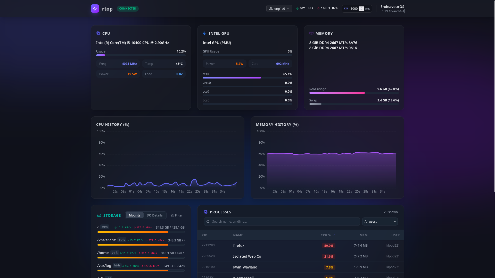
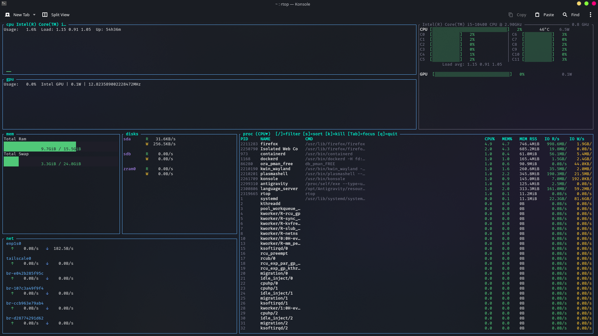

<div align="center">
    <h1>rtop: Rust Based Linux System Monitor</h1>
    <p>A next-generation system telemetry agent, Web dashboard, and MCP server.</p>
    
    
    
    
    <br/>
    <a href="https://github.com/sponsors/klpod221">
        
    </a>
    <a href="https://www.buymeacoffee.com/klpod221">
        
    </a>
</div>

## 📝 Description

**rtop** is an advanced, high-performance system monitoring tool built with Rust and Vue 3. It serves multiple roles: an interactive Web UI dashboard (similar to `btop` but in the browser), a background telemetry agent for Linux systems, and an MCP (Model Context Protocol) server for LLMs to query system metrics. With modular collection capabilities, it provides deep inspection for CPU, Memory, Disks, Networks, Processes, and multi-vendor GPUs (Intel, NVIDIA, AMD) with exceptionally low overhead.

## 🚀 Table Of Content

- [📝 Description](#-description)
- [🚀 Table Of Content](#-table-of-content)
- [📸 Screenshots](#-screenshots)
  - [Web Dashboard UI](#web-dashboard-ui)
  - [CLI Dashboard UI (In Progress)](#cli-dashboard-ui-in-progress)
- [✨ Features](#-features)
  - [💻 Comprehensive Data Collection](#-comprehensive-data-collection)
  - [🌐 Modern Web Interface](#-modern-web-interface)
  - [🤖 LLM \& Automation Ready](#-llm--automation-ready)
- [⚙️ Installation Guide](#️-installation-guide)
- [💻 Command Line Usage](#-command-line-usage)
  - [Examples](#examples)
- [🚀 Development](#-development)
  - [Prerequisites](#prerequisites)
  - [Installation](#installation)
  - [Project Structure](#project-structure)
  - [Key Technologies](#key-technologies)
- [🔒 Security Considerations](#-security-considerations)
- [🤝 Contributing](#-contributing)
- [❗ Known Issues](#-known-issues)
- [📝 License](#-license)
- [👤 Author](#-author)
- [🙏 Acknowledgments](#-acknowledgments)
- [📮 Support](#-support)
- [🗺️ Roadmap](#️-roadmap)
  - [Completed](#completed)
  - [Planned](#planned)
- [👥 Contributors](#-contributors)

## 📸 Screenshots

### Web Dashboard UI


### CLI Dashboard UI (In Progress)


## ✨ Features

### 💻 Comprehensive Data Collection
- **CPU & Memory**: Per-core metrics, frequency, load averages, temperature, and RSS memory analysis.
- **Process Management**: Backend-sorted and dynamically filtered process table with CPU/Mem/IO statistics.
- **Storage & Network**: Mount-point specific IO telemetry and network interface filtering.
- **Multi-GPU Support**: In-depth topology telemetry for Intel, NVIDIA, and AMD architectures.

### 🌐 Modern Web Interface
- **Real-Time WebSocket Pipeline**: Zero-latency dashboard updates delivered directly from the agent.
- **Glassmorphism Design**: Rich, responsive, mobile-first aesthetic built with Vue 3 and Tailwind CSS.
- **Dynamic Configuration**: Adjust poll rates, sort orders, and filters directly from the panel.

### 🤖 LLM & Automation Ready
- **MCP Server Built-in**: Exposes system telemetry and functions over JSON-RPC for AI model tool calling.
- **Modular Subcommands**: Switch easily between agent mode, local CLI inspection, web server, and MCP nodes.

## ⚙️ Installation Guide

The easiest way to install **rtop** on Linux is via the provided installation script. This will compile both the Vue frontend and the Rust backend, then install the binary system-wide.

1. Clone the repository:
```bash
git clone https://github.com/klpod221/rtop.git
cd rtop
```

2. Run the interactive installer:
```bash
sudo ./install.sh
```

*(This will compile release artifacts, move the binary to `/usr/local/bin/`, and set the necessary capabilities/SUID for advanced telemetry extraction).*

## 💻 Command Line Usage

**rtop** comes with a rich set of subcommands to interact with the system monitor in various modes:

```bash
Usage: rtop [OPTIONS] [COMMAND]

Commands:
  get      Collect and print system metrics (JSON or flat)
  agent    Run the telemetry agent daemon
  service  Install / uninstall / manage the systemd service
  web      Start the embedded Web UI server
  mcp      Start the MCP JSON-RPC 2.0 server (stdio)
  tui      Interactive terminal UI (btop-style)
  help     Print this message or the help of the given subcommand(s)

Options:
      --config <CONFIG>  Path to config.json (default: ~/.config/rtop/config.json)
  -h, --help             Print help
  -V, --version          Print version
```

### Examples

- **Start the Web UI Dashboard**
  ```bash
  rtop web
  ```
  *(Then open `http://127.0.0.1:8080` in your browser - You can change the port in `config.json`)*

- **Open the Terminal UI (TUI)**
  ```bash
  rtop tui
  ```
  

- **Run as an MCP Server (for AI Context)**
  ```bash
  rtop mcp
  ```

- **Manage the Background Service**
  ```bash
  sudo rtop service install
  sudo rtop service start
  ```

## 🚀 Development

### Prerequisites
- **Rust** (v1.75 or higher)
- **Node.js** (v18 or higher)
- **Linux Kernel** (For `/proc` & `/sys` native collection)

### Installation

1. Clone the repository
```bash
git clone https://github.com/klpod221/rtop.git
cd rtop
```

2. Install dependencies & Run Development Mode
```bash
# Terminal 1: Run Web UI locally
cd web
npm install
npm run dev

# Terminal 2: Run Rust WebSocket Server & Collector
cargo run --bin rtop -- serve
```

### Project Structure
- `crates/collector/` - Core Linux system metric extraction logic.
- `crates/server/` - Axum-based HTTP/WebSocket server for web interface.
- `crates/agent/` - Background daemon runner for headless metric pushing.
- `crates/mcp/` - Model Context Protocol JSON-RPC implementation.
- `crates/cli/` - Subcommand router and CLI interface.
- `crates/config/` - Configuration management and schema definitions.
- `web/` - Vue 3 front-end dashboard application.

### Key Technologies

| Layer | Technology | Purpose |
|-------|-----------|---------|
| **Backend** | Rust | Core daemon, safety, concurrency, system access |
| **Networking** | Axum / Tokio | High-performance WebSocket and HTTP routing |
| **Frontend UI** | Vue 3 | Reactive interface framework |
| **Styling** | Tailwind CSS v4 | Rapid, beautiful utility-class styling |
| **IPC** | MCP (JSON-RPC) | Contextual agent access for LLM interaction |

## 🔒 Security Considerations

- **Capabilities vs SUID**: Rtop utilizes specific Linux capabilities (`cap_sys_ptrace`, etc.) where possible to avoid requiring full root access while extracting process IO and kernel data. 
- **Configuration Scoping**: Sensitive parameters like `auth_token` for endpoints sit inside user-local structured configurations (`~/.config/rtop/config.json`).
- **Data Validation**: WebSockets inputs strictly parse structs before committing interface modifications or process filtering patterns.

## 🤝 Contributing

Contributions are welcome! Please follow these guidelines:
1. Fork the repository
2. Create a feature branch (`git checkout -b feature/amazing-feature`)
3. Commit your changes (`git commit -m 'Add amazing feature'`)
4. Push to the branch (`git push origin feature/amazing-feature`)
5. Open a Pull Request

## ❗ Known Issues

- Multi-GPU layout scaling might encounter overflow on specific ultra-compact mobile viewport widths.
- NVIDIA/AMD proprietary integrations rely on host driver paths existing; fallback gracefully handles absence but logs warnings.

## 📝 License

This project is licensed under the MIT License - see the LICENSE file for details.

## 👤 Author

**Bùi Thanh Xuân (klpod221)**
- Website: [klpod221.com](https://klpod221.com)
- GitHub: [@klpod221](https://github.com/klpod221)

## 🙏 Acknowledgments

- Highly inspired by the visual design and efficiency of `btop`.
- Built specifically emphasizing modern Agentic workflows using Model Context Protocols (MCP).

## 📮 Support

If you encounter any issues or have questions:
1. Check existing Issues
2. Create a new issue with detailed information

## 🗺️ Roadmap

### Completed
- [x] Comprehensive Hardware Telemetry Collection (CPU, RAM, Disks)
- [x] Multi-platform GPU architecture detection
- [x] Vue 3 Web Dashboard UI implementation
- [x] WebSocket Process Filtering Pipeline
- [x] Local daemon / configuration logic

### Planned
- [ ] Rewrite TUI dashboard
- [ ] Implement robust remote Node aggregation logic for managing multiple `rtop` instances
- [ ] Additional MCP endpoints for interactive metric plotting

## 👥 Contributors

Thanks to all the amazing people who have contributed to this project! 🎉

---

<div align="center">
    <p>Made with ❤️ by klpod221</p>
    <p>⭐ Star this repository if you find it helpful!</p>
</div>
